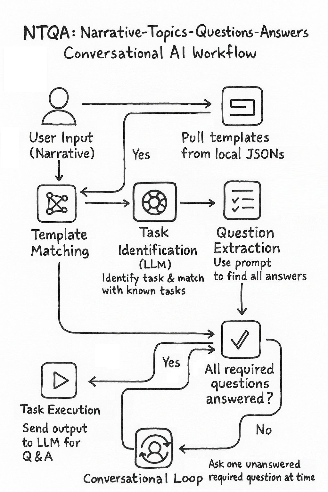

# 🧠 NTQA: Narrative-Topics-Questions-Answers


An intelligent command-line assistant powered by Google's Gemini API. It reads dynamic task definitions from JSON files and guides you interactively to fill required fields. Once done, it outputs structured JSON and can simulate running the task.

---

## ✅ Features

- Dynamic task loading from JSON files (`tasks/`).
- Conversational question/answer flow.
- Required vs optional field detection.
- Handles "run", "automate", "exit", "quit", etc.
- Structured JSON output for integration with other systems.
- Simulation of task execution.

---
## 📌Workflow: How it Works
- Narrative Input: Users describe what they want to do in natural language.
- Template Matching: The system finds a local JSON template for the task.
- Question Extraction: Required questions are checked for answers.
- Conversational Loop: If any required answer is missing, the system asks for it.
- Task Execution: Once all answers are ready, the task runs in a subprocess.
- AI Summary: Gemini summarizes the output, and users can ask more about it.



---
## 📁 Project Structure

```
project-root/
├── tasks/
│   ├── create_okta_user.json
│   └── create_user_profile.json
├── narrative10.py
└── README.md
```

---

## 🔧 Setup Instructions

### 1. **Install Python 3.8+**

Make sure Python is installed. You can verify using:

```bash
python --version
```

### 2. **Install Required Packages**

Use `pip` to install dependencies:

```bash
pip install google-generativeai
```

---

## 🔐 How to Get Gemini API Key

1. Go to [https://makersuite.google.com/app/apikey](https://makersuite.google.com/app/apikey)
2. Click **"Create API Key"**
3. Copy the key

> You’ll need this key to run the assistant.

---

## ▶️ How to Run the Assistant

Run the script using:

```bash
python task_run.py --api-key=YOUR_GEMINI_API_KEY
```

> Optional: You can change the Gemini model with `--model=gemini-1.5-pro` or other versions.

---

## 💼 Example Task File

**`tasks/create_okta_user.json`**

```json
{
  "task_name": "create_okta_user",
  "description": "Create a new user in OKTA system",
  "questions": [
    "What is the new okta user's first name?*",
    "What is the new okta user's last name?*",
    "What is the new okta user's email?*",
    "What is the user's job title?",
    "What's the user's username?"
  ],
  "output_schema": {
    "what_is_the_new_okta_users_first_name": "",
    "what_is_the_new_okta_users_last_name": "",
    "what_is_the_new_okta_users_email": "",
    "what_is_the_users_job_title": "",
    "whats_the_users_username": ""
  }
}
```

> Add more `.json` files to the `tasks/` folder for additional task types.

---

## 🧪 Sample Flow

```bash
🤖 Gemini Task Assistant Initialized using model: gemini-2.0-flash

📝 🧠 What do you want to do? (type 'exit' to quit)
> create a new okta user

📝 What is the new okta user's first name?
> Joe

📝 What is the new okta user's last name?
> Doe

📝 What is the new okta user's email?
> joe.doe@example.com

...

📦 Final JSON:
{
  "task": "create_okta_user",
  "data": {
    "what_is_the_new_okta_users_first_name": "Joe",
    ...
  }
}

💬 How can I help more? Do you still need me to change the query or start a new one?
You may also type 'automate' or 'run' to execute the completed task.

📝
> run

⚙️ Now running task: create_okta_user with data:
{
  ...
}
✅ Task completed.
```

---

## 🛑 Exit Anytime

Use:
```
go back
exit
quit
bye
```

To exit the assistant.

---

## 📞 Support

For help or bugs, feel free to contact the project maintainer.
---

## 🤝 Contributing

Contributions, suggestions, and improvements are welcome!

1. Fork the repo
2. Create your feature branch (`git checkout -b feature/my-feature`)
3. Commit your changes (`git commit -m 'Add my feature'`)
4. Push to the branch (`git push origin feature/my-feature`)
5. Open a Pull Request

---
