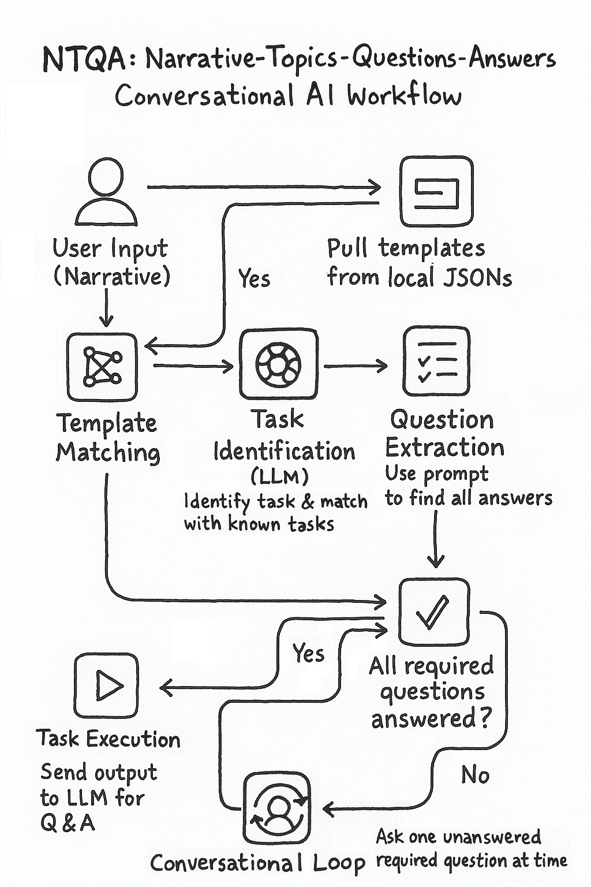

# 🧠 NTQA: Narrative-Topics-Questions-Answers


An intelligent command-line assistant powered by Google's Gemini API. It reads dynamic task definitions from JSON files and guides you interactively to fill required fields. Once done, it outputs structured JSON and can simulate running the task.

---

## ✅ Features

- Dynamic task loading from JSON files (`tasks/`).
- Conversational question/answer flow.
- Required vs optional field detection.
- Handles "run", "automate", "exit", "quit", etc.
- Structured JSON output for integration with other systems.
- Simulation of task execution.

---
## 📌Workflow: How it Works
- Narrative Input: Users describe what they want to do in natural language.
- Template Matching: The system finds a local JSON template for the task.
- Question Extraction: Required questions are checked for answers.
- Conversational Loop: If any required answer is missing, the system asks for it.
- Task Execution: Once all answers are ready, the task runs in a subprocess.
- AI Summary: Gemini summarizes the output, and users can ask more about it.



---
## 📁 Project Structure

```
project-root/
├── tasks/
│   ├── add_okta_attribute.json
│   ├── assign_user_to_group.json
│   ├── create_group.json
│   ├── create_okta_user.json
│   ├── get_future_date.json
│   ├── get_weather_in_period.json
│   ├── okta_profile.json
│   ├── run_a_program.json
│   ├── select_group_by_name.json
│   ├── select_user_by_name.json
│   ├── update_okta_user.json
│   └── user_profile.json
├── images/
│   └── NTQA_Workflow_Handwritten.png
├── get_future_date.py
├── get_weather.py
├── okta_user_account.py
├── task_run.py
├── requirements.txt
├── .gitignore
├── LICENSE
└── README.md
```

---

## 🔧 Setup Instructions

### 1. **Install Python 3.8+**

Make sure Python is installed. You can verify using:

```bash
python --version
```

### 2. **Install Required Packages**

Use `pip` to install dependencies:

```bash
pip install google-generativeai
```

---

## 🔐 How to Get Gemini API Key

1. Go to [Google AI Studio (MakerSuite)](https://makersuite.google.com/app/apikey)
2. Click **"Create API Key"**
3. Copy the key. You will add this to your `.env` file as `GEMINI_API_KEY`.
4. You can also specify the model you want to use (e.g., `gemini-3.1-flash-lite`, or `gemini-2.5-flash`) by setting `GEMINI_MODEL` in your `.env` file.

---

## 🌐 What is Okta? (And How to Get an Account)

**Okta** is a popular cloud-based identity and access management (IAM) service. It allows organizations to securely manage user authentication, authorization, and single sign-on (SSO) for their applications.

If you don't have an Okta account, you can easily get a free Developer Edition account:
1. Go to [developer.okta.com/signup](https://developer.okta.com/signup/).
2. Fill out the registration form.
3. Verify your email address and log in to your new Okta Admin Console.
4. Note your **Okta Domain** (e.g., `https://dev-12345678.okta.com`), which you will find in the top-right corner of the dashboard.

---

## 🔑 How to Get an Okta API Token

To allow this script to interact with your Okta account (e.g., to create users or manage attributes), you need an API token:
1. Log in to your Okta Admin Console.
2. In the left sidebar, navigate to **Security** > **API**.
3. Click on the **Tokens** tab.
4. Click **Create Token**.
5. Give your token a name (e.g., `NTQA Script Token`) and click **Create Token**.
6. **Copy the token value immediately.** You will not be able to view it again after closing the window.

---

## ⚙️ Setting Up the `.env` File

Before running the `task_run.py` program, you must create a `.env` file in the root directory of the project to store your Okta credentials and Gemini API Key securely.

1. Create a new file named `.env` in the `project-root/` directory.
2. Add the following lines to the file, replacing the placeholder values with your actual data:

```env
OKTA_URL=https://your-okta-domain.okta.com
OKTA_API_TOKEN=your_copied_api_token_here

GEMINI_API_KEY=your_gemini_api_key_here
GEMINI_MODEL=gemini-3.1-flash-lite
```

> **Note:** Ensure there are no trailing slashes (`/`) at the end of your `OKTA_URL`.

---

## ▶️ How to Run the Assistant

Run the script using:

```bash
python task_run.py --api-key YOUR_GEMINI_API_KEY
```

> Optional: You can change the Gemini model with `--model=gemini-1.5-pro` or other versions.

---

## 💼 Example Task File

**`tasks/create_okta_user.json`**

```json
{
  "task_name": "create_okta_user",
  "description": "Create a new user in OKTA system",
  "questions": [
    "What is the new okta user's first name?*",
    "What is the new okta user's last name?*",
    "What is the new okta user's email?*",
    "What is the user's job title?",
    "What's the user's username?"
  ],
  "output_schema": {
    "what_is_the_new_okta_users_first_name": "",
    "what_is_the_new_okta_users_last_name": "",
    "what_is_the_new_okta_users_email": "",
    "what_is_the_users_job_title": "",
    "whats_the_users_username": ""
  }
}
```

> Add more `.json` files to the `tasks/` folder for additional task types.

---

## 🧪 Sample Flow

```bash
🤖 Gemini Task Assistant Initialized using model: gemini-2.0-flash

📝 🧠 What do you want to do? (type 'exit' to quit)
> create a new okta user

📝 What is the new okta user's first name?
> Joe

📝 What is the new okta user's last name?
> Doe

📝 What is the new okta user's email?
> joe.doe@example.com

...

📦 Final JSON:
{
  "task": "create_okta_user",
  "data": {
    "what_is_the_new_okta_users_first_name": "Joe",
    ...
  }
}

💬 How can I help more? Do you still need me to change the query or start a new one?
You may also type 'automate' or 'run' to execute the completed task.

📝
> run

⚙️ Now running task: create_okta_user with data:
{
  ...
}
✅ Task completed.
```

---

## 🌟 Complex Automation Example

NTQA shines when chaining multiple tasks together. Try copying and pasting the following prompt into the assistant to see it orchestrate multiple actions automatically:

> "Amanda Smith" is traveling to Washington DC next week for a 5 day trip. She wants to be informed about the weather during her stay. 
> Create a new okta user using her first dot last names at gmail as username and email. 
> Then create or update 4 new attributes one called location 'Location', title 'Location'. 
> The 2nd attribute is called 'Duration', title 'Duration' and set duration in days. 
> The 3rd attribute is called 'Weather', title 'Weather', updated with the ('weather') from weather api response. 
> The 4th attribute is called 'Weather_Note', title 'Weather Note', updated it with ('note') from the weather api response.
> Update the user with the new attribute values.
> The new user is manager and needs to be added to the managers group. 
> She also needs to be assigned to the following groups 'Smith_Family', 'Smiths', 'zone_one', 'zone_two', 'zone_four', and 'zone_five'.

**What to expect:**
1. The assistant will parse this complex narrative and identify all the necessary tasks (getting future dates, fetching weather, creating an Okta user, adding attributes, updating the user, and assigning groups).
2. It will automatically extract the required parameters from your prompt (e.g., "Amanda", "Smith", "Washington DC", "5 days").
3. If any required information for any of the tasks is missing, it will ask you for it.
4. Once all data is collected, type `run` or `automate`, and it will execute all the tasks sequentially without requiring any code changes!

**Sample Output:**
```bash
python task_run.py
🤖 Gemini Task Assistant Initialized using model: gemini-3.1-flash-lite

📝 🧠 What do you want to do? (type 'exit' to quit)
   (type your message across multiple lines — press Enter on a blank line to submit)
"Amanda Smith" is traveling to Washington DC next week for a 5 day trip. She wants to be informed about the weather during her stay. 
Create a new okta user using her first dot last names at gmail as username and email. 
Then create or update 4 new attributes one called location "Location", title "Location". 
The 2nd attribute is called "Duration", title "Duration" and set duration in days. 
The 3rd attribute is called "Weather", title "Weather", updated with the ('weather') from weather api response. 
The 4th attribute is called "Weather_Note", title "Weather Note", updated it with ('note') from the weather api response.
Update the user with the new attribute values.
The new user is manager and needs to be added to the managers group. 
She also needs to be assigned to the following groups "Smith_Family", "Smiths", "zone_one", "zone_two", "zone_four", and "zone_five"

✏️  (spell-corrected) "Amanda Smith" is traveling to Washington, D.C. next week for a 5-day trip. She wants to be informed about the weather during her stay. 
Create a new Okta user using her first dot last name at gmail as the username and email. 
Then, create or update 4 new attributes: one called "Location" (title "Location"), the 2nd attribute called "Duration" (title "Duration") set to the duration in days, the 3rd attribute called "Weather" (title "Weather") updated with the ('weather') from the weather API response, and the 4th attribute called "Weather_Note" (title "Weather Note") updated with the ('note') from the weather API response. 
Update the user with the new attribute values. 
The new user is a manager and needs to be added to the managers group. 
She also needs to be assigned to the following groups: "Smith_Family", "Smiths", "zone_one", "zone_two", "zone_four", and "zone_five".
DONE!!!!
🔄 Auto-retry 1/3 — still extracting answers from your prompt...

📦 Final JSON: (Executing 25)
[
  {
    "task": "Get Future Date",
    "data": {
      "What is the timeframe/period (next week or next month)?*": "next week",
      "What is the duration of the trip (number of days)?*": "5"
    }
  },
  {
    "task": "Get Weather in Period",
    "data": {
      "What is the location (city name)?*": "Washington, D.C.",
      "What is the start date (YYYY-MM-DD)? (If a date was calculated, answer with exactly '${Get Future Date.start_date}'. Otherwise, provide the date)*": "${Get Future Date.start_date}",
      "What is the end date (YYYY-MM-DD)? (If a date was calculated, answer with exactly '${Get Future Date.end_date}'. Otherwise, provide the date)*": "${Get Future Date.end_date}"
    }
  },
  {
    "task": "Create Okta User",
    "data": {
      "What is the new okta user's first name?*": "Amanda",
      "What is the new okta user's last name?*": "Smith",
      "What is the new okta user's email?*": "Amanda.smith@gmail.com",
      "What is the user's job title?": "manager",
      "What's the user's username?*": "Amanda.smith@gmail.com"
    }
  },
  {
    "task": "Add Okta Attribute",
    "data": {
      "What is the name of the new Okta attribute?*": "Location",
      "What is the title/label of the new Okta attribute?": "Location",
      "What is the type of the new Okta attribute? (string/number/boolean)": "string"
    }
  },
  {
    "task": "Add Okta Attribute",
    "data": {
      "What is the name of the new Okta attribute?*": "Duration",
      "What is the title/label of the new Okta attribute?": "Duration",
      "What is the type of the new Okta attribute? (string/number/boolean)": "number"
    }
  },
  {
    "task": "Add Okta Attribute",
    "data": {
      "What is the name of the new Okta attribute?*": "Weather",
      "What is the title/label of the new Okta attribute?": "Weather",
      "What is the type of the new Okta attribute? (string/number/boolean)": "string"
    }
  },
  {
    "task": "Add Okta Attribute",
    "data": {
      "What is the name of the new Okta attribute?*": "Weather_Note",
      "What is the title/label of the new Okta attribute?": "Weather Note",
      "What is the type of the new Okta attribute? (string/number/boolean)": "string"
    }
  },
  {
    "task": "Update Okta User",
    "data": {
      "What is the ID of the user? (If a user was just created or selected, answer with exactly '${Create Okta User.id}' or '${Find a user by first name and last name.id}'. Otherwise, provide the actual ID)**": "${Create Okta User.id}",
      "What is the name of the attribute to update?*": "Location",
      "What is the value to set for this attribute?*": "Washington, D.C."
    }
  },
  {
    "task": "Update Okta User",
    "data": {
      "What is the ID of the user? (If a user was just created or selected, answer with exactly '${Create Okta User.id}' or '${Find a user by first name and last name.id}'. Otherwise, provide the actual ID)**": "${Create Okta User.id}",
      "What is the name of the attribute to update?*": "Duration",
      "What is the value to set for this attribute?*": "5"
    }
  },
  {
    "task": "Update Okta User",
    "data": {
      "What is the ID of the user? (If a user was just created or selected, answer with exactly '${Create Okta User.id}' or '${Find a user by first name and last name.id}'. Otherwise, provide the actual ID)**": "${Create Okta User.id}",
      "What is the name of the attribute to update?*": "Weather",
      "What is the value to set for this attribute?*": "${Get Weather in Period.weather}"
    }
  },
  {
    "task": "Update Okta User",
    "data": {
      "What is the ID of the user? (If a user was just created or selected, answer with exactly '${Create Okta User.id}' or '${Find a user by first name and last name.id}'. Otherwise, provide the actual ID)**": "${Create Okta User.id}",
      "What is the name of the attribute to update?*": "Weather_Note",
      "What is the value to set for this attribute?*": "${Get Weather in Period.note}"
    }
  },
  {
    "task": "Select Group By Name",
    "data": {
      "What is the name of the Okta group to search for?*": "managers"
    }
  },
  {
    "task": "Assign User to Group",
    "data": {
      "What is the ID of the Okta group? (If a group was just created or selected, answer with exactly '${Create Okta Group.id}' or '${Select Group By Name.id}'. Otherwise, provide the actual ID)*": "${Select Group By Name.id}",
      "What is the email or ID of the user to assign? (If a user was just created, answer with exactly '${Create Okta User.id}'. Otherwise, provide the email or ID)*": "${Create Okta User.id}"
    }
  },
  {
    "task": "Select Group By Name",
    "data": {
      "What is the name of the Okta group to search for?*": "Smith_Family"
    }
  },
  {
    "task": "Assign User to Group",
    "data": {
      "What is the ID of the Okta group? (If a group was just created or selected, answer with exactly '${Create Okta Group.id}' or '${Select Group By Name.id}'. Otherwise, provide the actual ID)*": "${Select Group By Name.id}",
      "What is the email or ID of the user to assign? (If a user was just created, answer with exactly '${Create Okta User.id}'. Otherwise, provide the email or ID)*": "${Create Okta User.id}"
    }
  },
  {
    "task": "Select Group By Name",
    "data": {
      "What is the name of the Okta group to search for?*": "Smiths"
    }
  },
  {
    "task": "Assign User to Group",
    "data": {
      "What is the ID of the Okta group? (If a group was just created or selected, answer with exactly '${Create Okta Group.id}' or '${Select Group By Name.id}'. Otherwise, provide the actual ID)*": "${Select Group By Name.id}",
      "What is the email or ID of the user to assign? (If a user was just created, answer with exactly '${Create Okta User.id}'. Otherwise, provide the email or ID)*": "${Create Okta User.id}"
    }
  },
  {
    "task": "Select Group By Name",
    "data": {
      "What is the name of the Okta group to search for?*": "zone_one"
    }
  },
  {
    "task": "Assign User to Group",
    "data": {
      "What is the ID of the Okta group? (If a group was just created or selected, answer with exactly '${Create Okta Group.id}' or '${Select Group By Name.id}'. Otherwise, provide the actual ID)*": "${Select Group By Name.id}",
      "What is the email or ID of the user to assign? (If a user was just created, answer with exactly '${Create Okta User.id}'. Otherwise, provide the email or ID)*": "${Create Okta User.id}"
    }
  },
  {
    "task": "Select Group By Name",
    "data": {
      "What is the name of the Okta group to search for?*": "zone_two"
    }
  },
  {
    "task": "Assign User to Group",
    "data": {
      "What is the ID of the Okta group? (If a group was just created or selected, answer with exactly '${Create Okta Group.id}' or '${Select Group By Name.id}'. Otherwise, provide the actual ID)*": "${Select Group By Name.id}",
      "What is the email or ID of the user to assign? (If a user was just created, answer with exactly '${Create Okta User.id}'. Otherwise, provide the email or ID)*": "${Create Okta User.id}"
    }
  },
  {
    "task": "Select Group By Name",
    "data": {
      "What is the name of the Okta group to search for?*": "zone_four"
    }
  },
  {
    "task": "Assign User to Group",
    "data": {
      "What is the ID of the Okta group? (If a group was just created or selected, answer with exactly '${Create Okta Group.id}' or '${Select Group By Name.id}'. Otherwise, provide the actual ID)*": "${Select Group By Name.id}",
      "What is the email or ID of the user to assign? (If a user was just created, answer with exactly '${Create Okta User.id}'. Otherwise, provide the email or ID)*": "${Create Okta User.id}"
    }
  },
  {
    "task": "Select Group By Name",
    "data": {
      "What is the name of the Okta group to search for?*": "zone_five"
    }
  },
  {
    "task": "Assign User to Group",
    "data": {
      "What is the ID of the Okta group? (If a group was just created or selected, answer with exactly '${Create Okta Group.id}' or '${Select Group By Name.id}'. Otherwise, provide the actual ID)*": "${Select Group By Name.id}",
      "What is the email or ID of the user to assign? (If a user was just created, answer with exactly '${Create Okta User.id}'. Otherwise, provide the email or ID)*": "${Create Okta User.id}"
    }
  }
]

✅ Thank you for using Task Assistant service.
👋 Exiting Task Assistant.

📝 🧠 What do you want to do? (type 'exit' to quit, 'run' to execute one task with a pause, or 'automate' to execute all tasks without pauses)
```

---

## ⌨️ Available Commands

You can use the following commands at any prompt:

*   **`run`**: Executes the completed tasks sequentially, pausing after each task to let you ask questions about the output or type `continue` (or `c`) to proceed.
*   **`automate`**: Executes all completed tasks sequentially without pausing.
*   **`continue`** (or **`c`**): When in `run` mode, proceeds to the next task.
*   **`exit`**, **`quit`**, or **`bye`**: Exits the assistant immediately and prints the final JSON (complete or not).

## Run the server using: 
```
uvicorn api:app --reload
```
---

## 📞 Support

💬 Need Help or Found a Bug?
Feel free to open a new issue to report bugs or ask for help.

🙌 Want to Contribute?
You're welcome to submit a Pull Request (PR) to improve this project.

---
## 🤝 Contributing

Contributions, suggestions, and improvements are welcome!

1. Fork the repo
2. Create your feature branch (`git checkout -b feature/my-feature`)
3. Commit your changes (`git commit -m 'Add my feature'`)
4. Push to the branch (`git push origin feature/my-feature`)
5. Open a Pull Request

---
